# Sistema de Gestión de Parqueaderos con React Native

**Estudiante:** David Marcelo Guamán Medina  
**Profesor:** Jose Alzati Zarate  
**Universidad:** Saint Leo University  
**Curso:** Desarrollo de Apps Móviles COM-437ES-AVOL1  
**Fecha:** 25 de octubre de 2025

---

## 📋 Descripción del Proyecto

Aplicación móvil para Android desarrollada en React Native que digitaliza y automatiza la gestión integral de parqueaderos. La solución contempla dos interfaces principales: una aplicación para usuarios finales que permite la búsqueda de parqueaderos disponibles, el registro de vehículos y la gestión de pagos; y un panel administrativo web que facilita el control operativo, la configuración de tarifas, el monitoreo en tiempo real y la generación de reportes analíticos.

Este proyecto será construido con React Native y Expo para facilitar el desarrollo, pruebas y despliegue multiplataforma.

---

## 🎯 Objetivos

- Optimizar la gestión de parqueaderos mediante tecnología móvil
- Mejorar la experiencia del usuario final reduciendo tiempos de espera
- Facilitar el control operativo y administrativo de los parqueaderos
- Implementar una arquitectura escalable y mantenible siguiendo principios SOLID y arquitectura hexagonal

---

## 🚧 Problemática

Los sistemas tradicionales de gestión de parqueaderos presentan múltiples deficiencias:

- ❌ Procesos manuales propensos a errores humanos en registro y cálculo de tarifas
- ❌ Falta de visibilidad en tiempo real sobre disponibilidad de espacios
- ❌ Dificultades en conciliación de ingresos y control de accesos
- ❌ Ausencia de trazabilidad en transacciones
- ❌ Limitada capacidad para generar análisis de ocupación y tendencias
- ❌ Incertidumbre para conductores sobre espacios disponibles
- ❌ Congestión vehicular y pérdida de tiempo

Esta problemática se agudiza en zonas de alta densidad urbana donde la disponibilidad de estacionamiento es limitada y la rotación es constante.

---

## 🛠️ Tecnologías

### Frontend (Aplicación Móvil)
- **React Native** 0.72+
- **Expo** (workflow gestionado) para desarrollo, compilación y despliegue
- **Redux** para gestión de estado
- **React Navigation** para navegación entre pantallas
- **React Native Maps** para visualización de ubicaciones
- Compatible con **iOS** (versión 13.0+) y **Android** (API nivel 23+)

### Backend y Base de Datos
- **Firebase** como plataforma backend
- **Firestore** (base de datos NoSQL) para almacenamiento en tiempo real
- **Firebase Authentication** para autenticación segura de usuarios
- **Firebase Cloud Functions** para lógica del servidor

### Servicios Adicionales
- **Firebase Cloud Messaging** para notificaciones push
- **Firebase Analytics** para monitoreo y logging del sistema
- Integración con pasarelas de pago (tarjeta, transferencia, monederos digitales)

---

## 🏗️ Arquitectura

El proyecto implementa **Arquitectura Hexagonal** (Puertos y Adaptadores) propuesta por Molinari (2020), separando claramente la lógica de negocio de las interfaces externas y las tecnologías de infraestructura. Esta arquitectura se compone de tres capas principales:

### Capa de Dominio
- **Entidades centrales**: `Vehiculo`, `Espacio`, `Tarifa`, `Transaccion`
- Reglas de negocio fundamentales
- Completamente independiente de frameworks y tecnologías

### Capa de Aplicación
- **Casos de uso**: `RegistrarIngreso`, `CalcularTarifa`, `ProcesarPago`, `GenerarReporte`
- Orquestación de la lógica del dominio
- Implementa los principios SOLID para garantizar mantenibilidad

### Capa de Infraestructura
- Adaptadores para persistencia (Firestore)
- Adaptadores para servicios externos (Firebase Authentication, pasarelas de pago, servicios de mapas)
- Interfaces de usuario (aplicación móvil Android y panel web administrativo)

**Ventajas de esta arquitectura:**
- Flexibilidad para evolucionar el sistema sin comprometer el núcleo funcional
- Facilita pruebas automatizadas
- Permite trabajo colaborativo eficiente
- Código de alta calidad y mantenible

---

## ✨ Funcionalidades Principales

### Para Usuarios (Aplicación Móvil)
- 🗺️ **Mapa interactivo** con parqueaderos cercanos y disponibilidad en tiempo real
- 🔍 **Búsqueda y filtrado** por ubicación, tarifa, horarios y servicios adicionales
- 🚗 **Registro de vehículos** mediante ingreso manual del número de placa
- 📱 **Código QR** para ingreso y salida rápida del parqueadero
- 💳 **Múltiples métodos de pago**: tarjeta, transferencia, monederos digitales
- 📊 **Historial de estacionamientos** y gestión de pagos
- 🔔 **Notificaciones push** sobre tiempo de estadía, recordatorios de pago y promociones

### Para Administradores (Panel Web)
- 📈 **Dashboard en tiempo real** con métricas de ocupación actual, ingresos diarios y rotación de espacios
- 💰 **Gestión de tarifas dinámicas** con configuración por horarios, días especiales y eventos
- 🎥 **Control de accesos** y registro de entradas/salidas con visualización de cámaras de seguridad
- 📄 **Módulo de reportes** con exportación a Excel y PDF para análisis financiero y operativo
- 👥 **Gestión de usuarios**, roles y permisos del personal operativo

### Funcionalidades Core (Siguiendo Principios SOLID)

Según los principios SOLID descritos por Leiva (2021):

- **Registro automatizado** de vehículos con validación de placas mediante expresiones regulares
- **Cálculo automático de tarifas** con precisión de minutos y descuentos por permanencia prolongada
- **Tarifas diferenciadas** por tipo de vehículo (auto, moto, etc.)
- **Gestión de múltiples métodos de pago** con integración a pasarelas seguras y conciliación automática
- **Sistema de reservas anticipadas** para asegurar espacios antes de la llegada
- **Notificaciones automatizadas** mediante Firebase Cloud Messaging
- **Reportes analíticos** con gráficos interactivos para toma de decisiones
- **Sistema de fidelización** con acumulación de puntos y descuentos para usuarios frecuentes

---

## 📱 Interfaces

### Aplicación Móvil (Android)
- **Pantalla de splash** con carga de configuración inicial y logo de Saint Leo University
- **Mapa principal** con parqueaderos cercanos y disponibilidad en tiempo real
- **Detalle de parqueadero** mostrando disponibilidad, servicios, tarifas y horarios
- **Registro de vehículo** mediante ingreso manual del número de placa
- **Confirmación de ingreso** con generación de código QR para acceso rápido
- **Historial** completo de estacionamientos anteriores
- **Perfil de usuario** con configuración y método de pago preferido

### Panel Administrativo Web
- **Dashboard principal** con KPIs visuales (ocupación, ingresos, rotación)
- **Gestión de espacios** con representación gráfica del parqueadero
- **Configuración de tarifas** con calendario de precios dinámicos
- **Módulo de reportes** con filtros avanzados y exportación de datos
- **Administración de usuarios** y permisos del personal

---

## 🎨 Diseño UX/UI

El diseño seguirá principios de:
- **Simplicidad**: Interfaz intuitiva y fácil de usar
- **Accesibilidad**: Diseño responsive y compatible con lectores de pantalla
- **Consistencia**: Uso coherente de colores, tipografías y componentes
- **Feedback**: Respuestas visuales claras a las acciones del usuario

---

## 🖼️ Wireframes (Primeras pantallas)

A continuación se presentan los primeros wireframes del proyecto. Estas imágenes están versionadas en el repositorio dentro de la carpeta `wireframe/` y se referencian con rutas relativas para que se vean correctamente en GitHub.

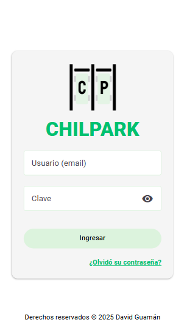

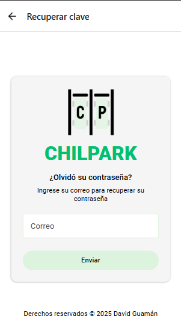


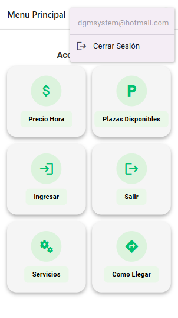

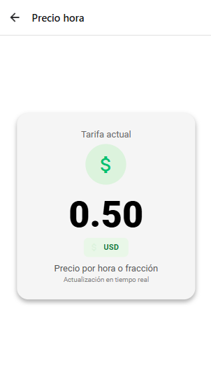

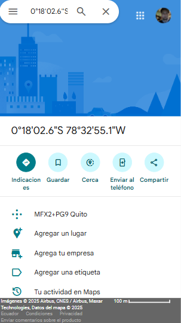

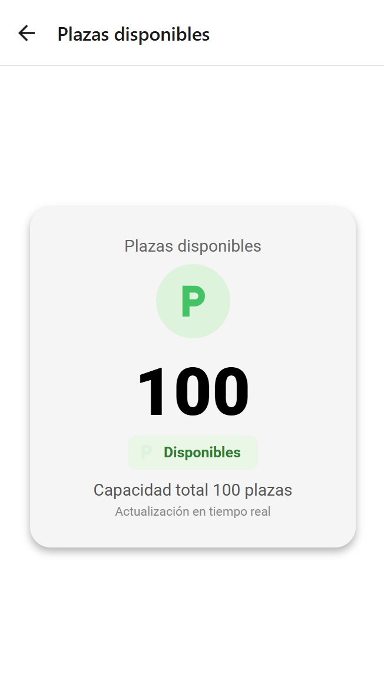

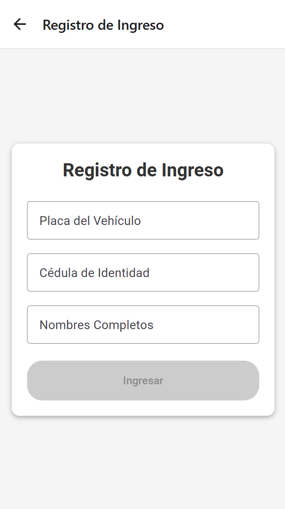


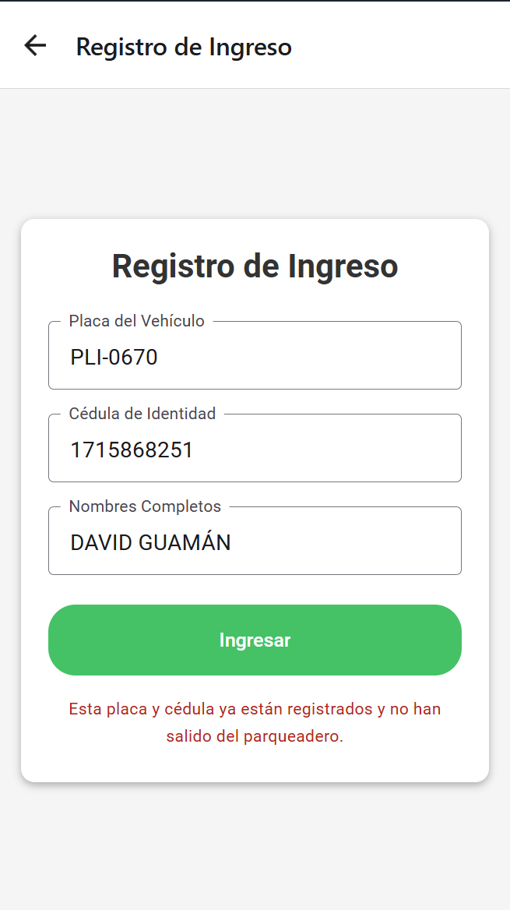

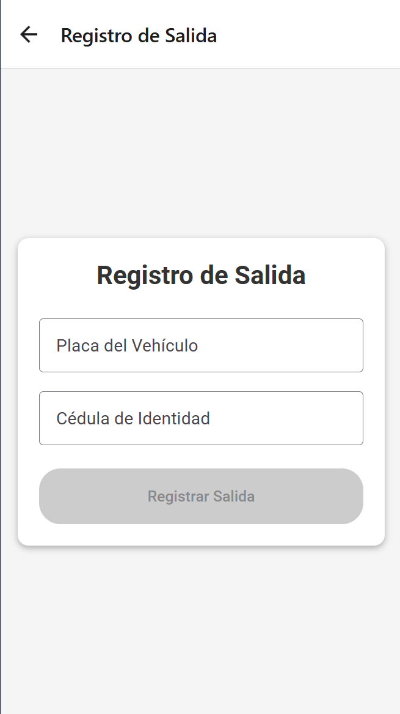


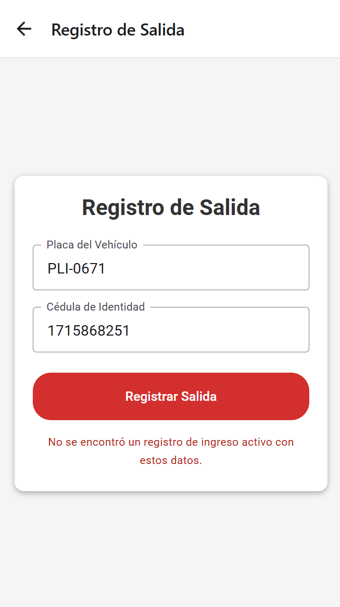

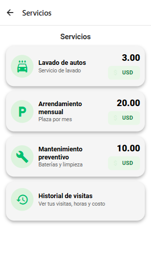

---

## 📦 Estructura del Proyecto

```
parking-app/
├── src/
│   ├── domain/              # Entidades y lógica de negocio
│   │   ├── entities/
│   │   │   ├── Vehiculo.js
│   │   │   ├── Espacio.js
│   │   │   ├── Tarifa.js
│   │   │   └── Transaccion.js
│   │   └── repositories/    # Interfaces de repositorios
│   ├── application/         # Casos de uso
│   │   └── useCases/
│   │       ├── RegistrarIngreso.js
│   │       ├── CalcularTarifa.js
│   │       ├── ProcesarPago.js
│   │       └── GenerarReporte.js
│   ├── infrastructure/      # Adaptadores
│   │   ├── firebase/        # Adaptadores de Firebase
│   │   │   ├── FirestoreAdapter.js
│   │   │   ├── AuthAdapter.js
│   │   │   └── StorageAdapter.js
│   │   ├── api/             # APIs externas
│   │   │   ├── PaymentGateway.js
│   │   │   └── MapsService.js
│   │   └── notifications/   # Firebase Cloud Messaging
│   ├── presentation/        # UI
│   │   ├── screens/
│   │   │   ├── MapScreen.js
│   │   │   ├── ParkingDetailScreen.js
│   │   │   ├── VehicleRegistrationScreen.js
│   │   │   ├── QRScreen.js
│   │   │   ├── HistoryScreen.js
│   │   │   ├── IngresoScreen.js
│   │   │   ├── SalidaScreen.js
│   │   │   └── ...
│   │   ├── components/
│   │   │   ├── ParkingCard.js
│   │   │   ├── MapMarker.js
│   │   │   └── PaymentModal.js
│   │   └── navigation/
│   │       └── AppNavigator.js
│   ├── shared/              # Utilidades compartidas
│   │   ├── constants/
│   │   ├── utils/
│   │   └── validators/
│   └── config/              # Configuración
│       ├── firebase.config.js
│       └── app.config.js
├── tests/                   # Pruebas
│   ├── unit/
│   ├── integration/
│   └── e2e/
├── docs/                    # Documentación
│   ├── wireframes/
│   ├── architecture/
│   └── api/
├── android/                 # Configuración Android
├── ios/                     # Configuración iOS (futuro)
├── .env.example
├── package.json
├── README.md
└── firebase.json
```

---

## 🚀 Roadmap de Desarrollo

### Módulo 1-2: Planificación y Diseño ✅
- Definición de requisitos
- Diseño de arquitectura
- Creación de wireframes
- Configuración del entorno de desarrollo

### Módulo 3-4: Desarrollo del MVP ✅
- Implementación de registro de vehículos (Ingreso/Salida)
- Sistema de ingreso/salida con QR
- Cálculo básico de tarifas en tiempo real
- Integración con base de datos Firestore
- Manejo de estado de plazas (ocupadas/disponibles)

### Módulo 5-6: Funcionalidades Avanzadas
- Mapa interactivo
- Sistema de pagos
- Notificaciones
- Panel administrativo básico

### Módulo 7-8: Refinamiento y Despliegue
- Pruebas de usuario
- Optimización de rendimiento
- Documentación final
- Preparación para despliegue

---

## 🧪 Pruebas

- **Unitarias**: Jest para lógica de negocio y componentes
- **Integración**: Testing de Firebase services y Firestore
- **E2E**: Detox para flujos completos de usuario en Android
- **Firebase Test Lab**: Pruebas en dispositivos reales en la nube
- **Manuales**: Pruebas de usabilidad con usuarios reales
- **Cobertura de código**: Objetivo mínimo del 80%

---

## 📚 Principios de Desarrollo

El proyecto sigue los **Principios SOLID**:

- **S** - Single Responsibility: Cada clase tiene una única responsabilidad
- **O** - Open/Closed: Abierto para extensión, cerrado para modificación
- **L** - Liskov Substitution: Las subclases pueden sustituir a sus clases base
- **I** - Interface Segregation: Interfaces específicas mejor que genéricas
- **D** - Dependency Inversion: Depender de abstracciones, no de implementaciones concretas

---

## 🔐 Seguridad

- **Firebase Authentication** con múltiples métodos de inicio de sesión
- Renovación automática de tokens de sesión
- Encriptación de datos sensibles en Firestore
- Validación de entrada en frontend y backend
- **Firestore Security Rules** para protección de datos
- Comunicación HTTPS obligatoria
- Cumplimiento de GDPR y regulaciones de privacidad
- Validación de placas mediante expresiones regulares
- Control de acceso basado en roles (RBAC)

---

## 📖 Referencias

1. Cruz Navas, J. (2023). *React Native: Aprende a crear aplicaciones móviles en un fin de semana*. Independently published.

2. Leiva, A. (2021). *Principios SOLID*. Leanpub. https://leanpub.com/principios-solid

3. Molinari, E. (2020). *Introducción a la Arquitectura de Software*. Leanpub. https://leanpub.com/arquitecturasoftware

---

## 👥 Equipo de Desarrollo

**David Marcelo Guamán Medina**
- Rol: Desarrollador Full Stack
- Universidad: Saint Leo University
- Curso: Desarrollo de Apps Móviles COM-437ES-AVOL1
- Profesor: Jose Alzati Zarate

---

## 📄 Licencia

Este proyecto es desarrollado con fines académicos para el curso de Desarrollo de Apps Móviles en Saint Leo University.

---

## 📞 Contacto

Para consultas sobre el proyecto:
- Estudiante: David Marcelo Guamán Medina
- Universidad: Saint Leo University
- Curso: COM-437ES-AVOL1

---

## 🙏 Agradecimientos

- Profesor Jose Alzati Zarate por la guía y retroalimentación
- Compañeros de clase por las discusiones constructivas
- Comunidad de React Native y Firebase por la documentación y recursos
- Saint Leo University por facilitar las herramientas de desarrollo

---

**Última actualización**: 12 de diciembre de 2025

**Estado del proyecto**: 🔧 En desarrollo — Implementado flujo completo de Ingreso, Salida, Tarifas y Menú Dinámico.

---

## 📌 Estado actual del código (Módulo 1 y 2)

### 🛠️ Mejoras Técnicas Recientes (v1.2)
- **Normalización de Datos**: Implementación de conversión automática a mayúsculas para placas y nombres, garantizando consistencia en las búsquedas (Case Insensitive).
- **Validaciones Robustas**:
  - Algoritmo de validación de Cédula Ecuatoriana (Módulo 10).
  - Prevención de doble ingreso: Verificación de estado 'activo' antes de permitir un nuevo registro.
- **Corrección de Navegación**: Solución al problema de enrutamiento en `MenuScreen` asegurando la redirección correcta a 'Salida' y 'Ingreso' independientemente de la configuración en Firestore.
- **Transacciones Atómicas**: Uso de `runTransaction` de Firestore para gestionar el contador de plazas y la creación de registros simultáneamente, evitando condiciones de carrera.
- **Pago en Salida**:
  - Nuevo flujo con selección de método: Tarjeta (crédito/débito) y Transferencia.
  - La salida se marca como `finalizado` y libera plaza solo tras pago exitoso.
  - QR con `status: 'PENDING'` antes de pagar y `status: 'PAID'` tras confirmar.
  - Mensaje de confirmación: `!Tu Pago fue exitoso¡` centrado.
- **Servicios y Historial**:
  - Item “Historial de visitas” en Servicios con navegación a `Historial`.
  - Layout de cards actualizado: valor y USD a la derecha para uniformidad.
  - Pantalla `Historial` solicita cédula, valida formato ecuatoriano y lista visitas finalizadas (horas y total).

### Integraciones y pantallas

- **Autenticación con Firebase Auth**:
  - Inicio de sesión: `src/presentation/screens/LoginScreen.js`
  - Recuperación de contraseña: `src/presentation/screens/RecoverPasswordScreen.js`
  - Cierre de sesión desde el header del menú: `src/presentation/navigation/AppNavigator.js`
- **Navegación principal**: `src/presentation/navigation/AppNavigator.js`
  - Stack Navigator gestionando: Login, RecuperarClave, Menu, Mapa, Precio, Plazas, Servicios, Historial, Ingreso, Salida.
- **Menú Dinámico**: `src/presentation/screens/MenuScreen.js`
  - Configuración en tiempo real desde Firestore (`config/menu`).
  - Navegación robusta con autocorrección de rutas para Ingreso y Salida.
- **Módulo de Ingreso**: `src/presentation/screens/IngresoScreen.js`
  - Formulario con validación de Cédula Ecuatoriana y Placa.
  - Verificación de duplicados (vehículo/persona ya dentro).
  - Transacciones atómicas en Firestore para asegurar consistencia.
  - Generación de código QR de ingreso.
  - Actualización en tiempo real del contador de plazas.
- **Módulo de Salida**: `src/presentation/screens/SalidaScreen.js`
  - Búsqueda de vehículos por placa (insensible a mayúsculas/minúsculas).
  - Cálculo automático de tarifa basado en tiempo de permanencia (horas o fracción).
  - Generación de código QR de salida con resumen de pago.
  - Flujo de pago con selección de método (Tarjeta/Transferencia).
  - Cierre de ticket y liberación de plaza en Firestore sólo tras pago exitoso.
- **Plazas Disponibles**: `src/presentation/screens/PlazasDisponiblesScreen.js`
  - Visualización en tiempo real de la ocupación del parqueadero.
- **Precio en tiempo real**: `src/presentation/screens/PrecioScreen.js`
  - Visualización de la tarifa actual configurada en el sistema.
 - **Historial de visitas**: `src/presentation/screens/HistoryScreen.js`
   - Form con cédula validada; listado de visitas finalizadas con horas y total.

### Adaptadores y configuración Firebase

- Configuración central de Firebase: `src/config/firebase.config.js`
- Adaptadores: `AuthAdapter`, `FirestoreAdapter`, `StorageAdapter` en `src/infrastructure/firebase/`

---

## 🗄️ Esquemas de datos en Firestore

### Precio
- Ruta: `config/pricing`
- Campos: `priceCents` (entero, centavos) o `pricing` (decimal, USD).

### Menú
- Ruta: `config/menu`
- Campos: `items` (Array).
- Estructura: `{ key, label, icon, type, value, order, enabled }`
- Claves especiales: `ingresar`, `salir` (autodetectadas por la app).

### Plazas
- Ruta: `config/plazas`
- Campos:
  - `available`: Plazas disponibles (Number).
  - `ocupadas`: Plazas ocupadas (Number).
  - `total`: Capacidad total (Number).

### Ingresos
- Ruta: `ingresos/{documentId}`
- Campos:
  - `placa`: Placa del vehículo (String, Mayúsculas).
  - `cedula`: Cédula del conductor (String).
  - `nombres`: Nombre del conductor (String).
  - `fechaIngreso`: Timestamp.
  - `estado`: 'activo' | 'finalizado'.
  - `fechaSalida`: Timestamp (al salir).
  - `horasCobradas`: Number (al salir).
  - `totalPagado`: Number (centavos, al salir).
  - `tarifaAplicada`: Number (centavos, al salir).

---

## 🔒 Reglas recomendadas de Firestore

```
rules_version = '2';
service cloud.firestore {
  match /databases/{database}/documents {
    match /config/{document=**} {
      allow read: if true;
      allow write: if request.auth != null;
    }
    match /ingresos/{document=**} {
      allow read, write: if true; // Ajustar a solo auth en producción
    }
  }
}
```

---

## ⚙️ Configuración de Firebase (Expo)

- Claves en `app.json` → `expo.extra` o variables de entorno.

---

## 🧭 Navegación y comportamiento

- **Flujo de Ingreso**: Menú -> Ingresar -> Formulario -> QR -> Menú.
- **Flujo de Salida**: Menú -> Salir -> Formulario -> QR (PENDING) -> Pago -> QR (PAID) -> Menú.
- **Validaciones**: Cédula ecuatoriana, Placa única activa, Plazas disponibles > 0.
 - **Servicios**: Cards con valor y USD a la derecha; “Historial de visitas” sin precio.

---

## 🚀 Prueba rápida

1. Configura `app.json` con tus claves de Firebase.
2. En Firestore, crea las colecciones `config` (menu, pricing, plazas).
3. Inicia la app y prueba el flujo completo de Ingreso y Salida.
